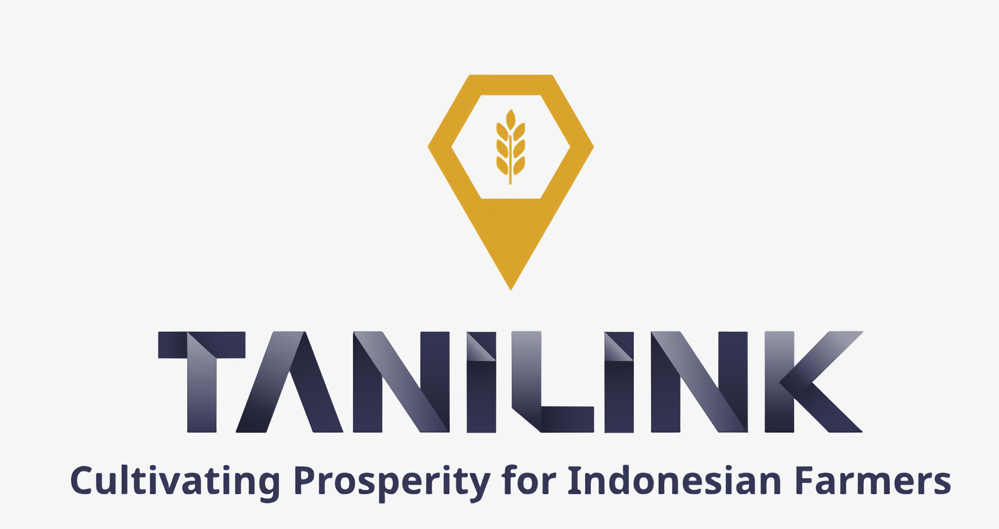
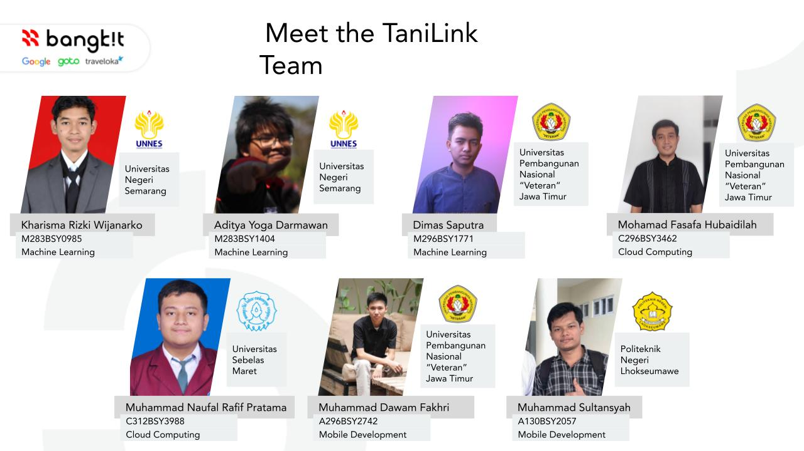
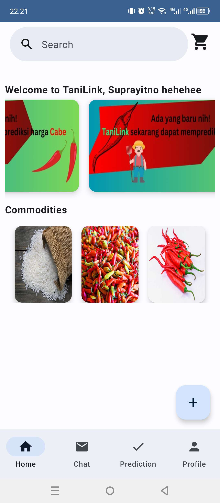
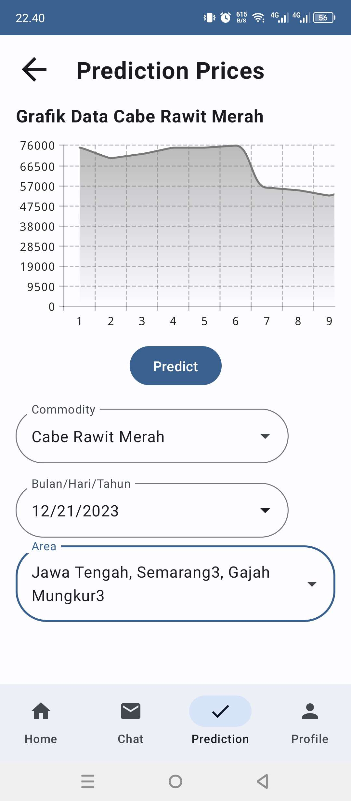
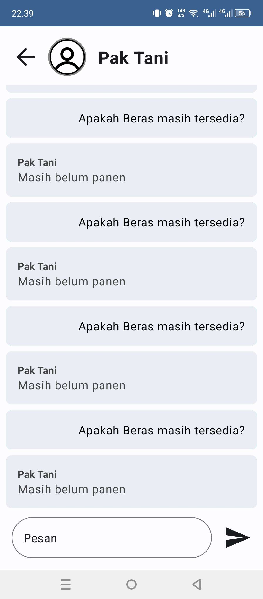
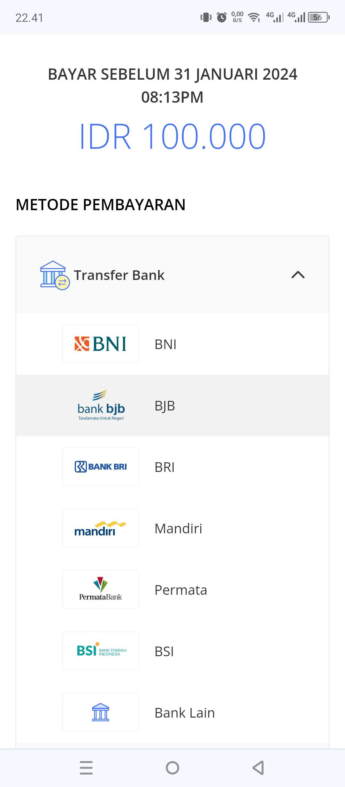

# TaniLink
### Cultivating Prosperity for Indonesian Farmers

## Project Description

 Indonesia, despite having a rich agricultural history, is facing significant challenges in its agricultural sector. The sector's income disparities, especially in urban areas, threaten the country's agrarian identity, despite having a significant number of farmers. The backbone of the country, farmers, face various economic difficulties, including unfair pricing and unfavourable public perception. To tackle this issue, we suggest implementing the TaniLink platform, which incorporates technology to offer direct connections between buyers and sellers, as well as pricing information. By modernizing the conventional farming system, this initiative aims to improve the welfare of the farming community and ensure fair product pricing.

## Project Tech Stack
<b>Machine Learning:</b> TensorFlow, NumPy, Pandas, Google Colab, Git and GitHub, FastAPI 
<b>Cloud Computing:</b> Visual Studio, Postman, gRPC, SignalR, .NET Core 8, Entity Framework, Identity Framework, ML.NET, Microsoft SQL Server, Compute Engine, Cloud Storage (Firebase) 
<b>Mobile Development:</b> Android Studio, Emulator Android, Postman, Glide, Retrofit, Room, Vico extensible Chart, Material Design 3, gRPC client, Firebase client, Hawk Session Manager 

## Project Teams

## Project Preview

## Accessible Project App
<b>Machine Learning:</b> <a href="https://tanilink-ml.bantuin.me/docs">Machine Learning API</a> 
<b>Cloud Computing:</b> <a href="https://tanilink.bantuin.me/">Cloud Computing API</a> 
<b>Mobile Development:</b> <a href="https://github.com/Topi-Batu/tanilink-mobile/releases">Mobile Development App</a> 

## Documentation Project App
<b>Machine Learning:</b> <a href="https://github.com/Topi-Batu/TaniLink-ML-Model">Machine Learning Documentation</a> 
<b>Cloud Computing:</b> <a href="https://github.com/Topi-Batu/TaniLink_Backend">Cloud Computing Documentation</a> 
<b>Mobile Development:</b> <a href="https://github.com/Topi-Batu/tanilink-mobile">Mobile Development Documentation</a> 

<!--

**Here are some ideas to get you started:**

🙋‍♀️ A short introduction - what is your organization all about?
🌈 Contribution guidelines - how can the community get involved?
👩‍💻 Useful resources - where can the community find your docs? Is there anything else the community should know?
🍿 Fun facts - what does your team eat for breakfast?
🧙 Remember, you can do mighty things with the power of [Markdown](https://docs.github.com/github/writing-on-github/getting-started-with-writing-and-formatting-on-github/basic-writing-and-formatting-syntax)
-->
